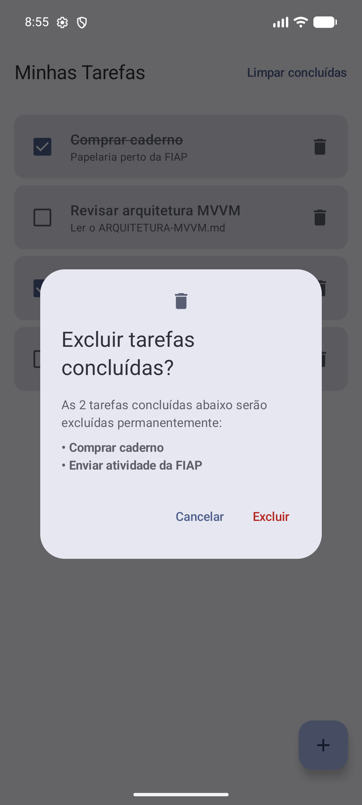
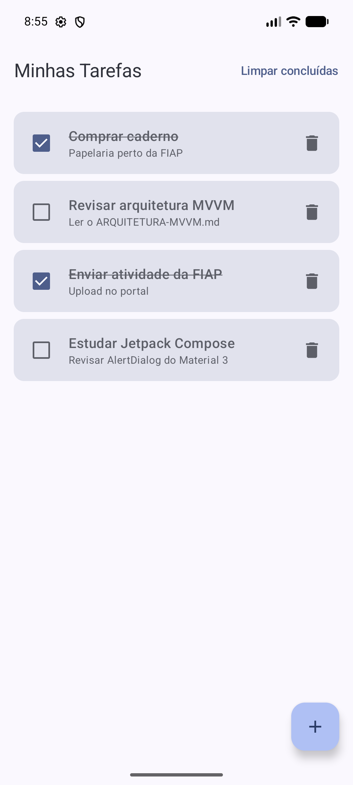
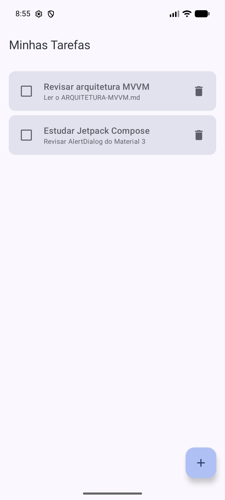

# Evidências — Confirmação de exclusão de tarefas

Capturas feitas no emulador Pixel 8 (Android 16). A tarefa usada no teste foi **Revisar arquitetura MVVM**, que fica no meio da lista, para mostrar que apenas ela é removida e que as demais continuam com prazo, destaque de atraso e conclusão preservados.

## 1. Lista antes da exclusão

Quatro tarefas cadastradas: uma com prazo vencido (em vermelho), uma concluída e duas pendentes.

## 2. Diálogo aberto com a tarefa selecionada

Ao tocar na lixeira de **Revisar arquitetura MVVM**, o `AlertDialog` do Material 3 aparece sobre a lista, informando que a tarefa será excluída e exibindo o título dela.

## 3. Resultado ao cancelar

Tocando em **Cancelar**, o diálogo fecha e a lista permanece igual.

## 4. Nova abertura do diálogo

Tocando novamente na lixeira da mesma tarefa, o diálogo é reaberto.

## 5. Resultado após confirmar a exclusão

Tocando em **Excluir**, o diálogo fecha e somente **Revisar arquitetura MVVM** é removida.

## Extra: exclusão das tarefas concluídas

Além da exclusão individual, a barra superior mostra a ação **Limpar concluídas** sempre que existe ao menos uma tarefa concluída. Ela também passa por um diálogo de confirmação sobre a lista.

### 6. Lista com tarefas concluídas

Duas tarefas concluídas (riscadas) e duas pendentes.

### 7. Diálogo listando as tarefas concluídas

Ao tocar em **Limpar concluídas**, o diálogo informa quantas tarefas serão excluídas e mostra o título de cada uma.

### 8. Resultado ao cancelar

Tocando em **Cancelar**, nada é removido.

### 9. Resultado após confirmar

Tocando em **Excluir**, apenas as tarefas concluídas são removidas e a ação **Limpar concluídas** some da barra.

## Resumo da implementação

- `TarefaViewModel` guarda a tarefa selecionada em `tarefaParaExcluir` (`StateFlow<Tarefa?>`) e expõe `solicitarExclusao`, `cancelarExclusao` e `confirmarExclusao`.
- `ListaTarefasScreen` observa esse estado e exibe o `ConfirmarExclusaoDialog` sobre a própria lista, sem nova rota de navegação.
- Para as concluídas, `TarefaDao.deletarConcluidas()` executa `DELETE FROM tarefas WHERE concluida = 1`, exposto pelo `TarefaRepository`. O `TarefaViewModel` controla o diálogo com `confirmandoExclusaoConcluidas` e as funções `solicitarExclusaoConcluidas`, `cancelarExclusaoConcluidas` e `confirmarExclusaoConcluidas`.
- Previews adicionadas: **Confirmação de exclusão** (lista com o diálogo aberto), **Diálogo de exclusão** e **Confirmação de exclusão das concluídas**.
- Testes de UI em `ListaTarefasExclusaoTest` e `ListaTarefasExclusaoConcluidasTest` cobrem cancelar e confirmar nos dois fluxos. `TarefaDaoTest` ganhou `deletarConcluidasMantemTarefasPendentes`.
